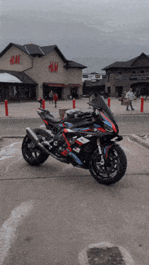

<table>
<tr>
<td>

Bilgisayar mühendisi olarak yazılım geliştirme odaklı bir kariyer hedefliyorum. 
Eğitim sürecimde yazılım geliştirme, sistem analizi ve veri yapıları konularında bilgi ve deneyim kazandım. 
Demiryaka Holding Metal Matris’te yaptığım staj ile teorik bilgimi pratikle birleştirme ve iş süreçlerine uyum sağlama fırsatı buldum. 
Şu anda backend teknolojileri üzerinde yoğunlaşıyor ve bu alanda uzmanlaşmayı hedefliyorum. 
Takım çalışmasına yatkınlığım ve problem çözme yeteneklerimle yenilikçi projelere katkı sağlamaya hazırım.

 

</td>
<td>

</td>
</tr>
</table>
